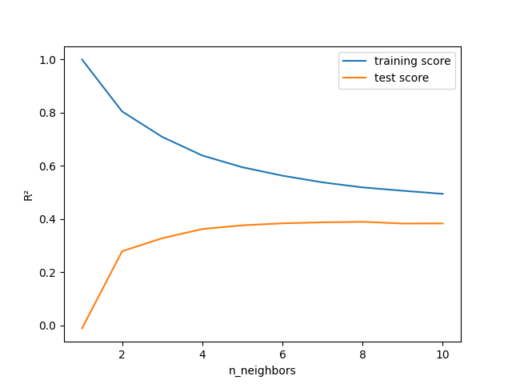
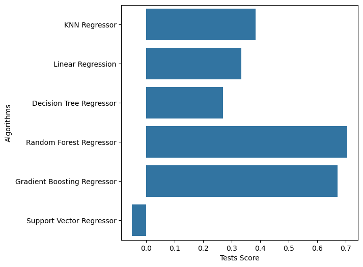

# Model card

## Project context

Data preprocessing, Model training & Model evaluation

## Data

**Input dataset** = "data/properties.csv" 

**Target variable** = "price"

**Features** =
- num_features = ['latitude', 'longitude', 'construction_year', 'total_area_sqm','surface_land_sqm', 'nbr_frontages', 'nbr_bedrooms', 'terrace_sqm', 'garden_sqm', 'primary_energy_consumption_sqm', 'cadastral_income']

- fl_features = ['fl_furnished', 'fl_open_fire', 'fl_terrace', 'fl_garden', 'fl_swimming_pool', 'fl_floodzone', 'fl_double_glazing']

- cat_features = ['property_type', 'subproperty_type', 'region', 'province', 'locality',
       'equipped_kitchen', 'state_building', 'epc', 'heating_type']

## Model details

Models tested on Day 1
- Linear Regression with only 3 features,
- Linear Regression with median strategy for SimpleImputer,
- Linear Regression with test_size=0.25,
- Linear Regression with skewness addressed,
- Linear Regression with outliers addressed,
- Linear Regression with skewness and outliers addressed,
- Linear Regression with scaling addressed 

Models tested on Day 2
- GradientBoostingRegressor,
- RandomForestRegressor,
- DecisionTreeRegressor,
- KNeighborsRegressor,
- SVR

Models tested on Day 3
- SVR after scaling

Final model chosen: GradientBoostingRegressor

## Performance

Performance metrics for the various models tested
- 3Features
    - Train R² score: 0.053956942628710314
    - Test R² score: 0.062424262775907846

- AllFeatures
    - Train R² score: 0.35219611032772424
    - Test R² score: 0.3923934272636701

- AllFeatures with median strategy for SimpleImputer:
    - Train R² score: 0.3522687666677199
    - Test R² score: 0.3926858948838937

- AllFeatures with test_size=0.25
    - Train R² score: 0.34945282792412624
    - Test R² score: 0.3956021907067506

- Features with skewness addressed (noSkewtrainAll.py)
    - Train R² score: 0.3749074750231035
    - Test R² score: 0.4307915410859161

- Features with outliers addressed (outliers_train.py)  
    removed [1914 rows x 30 columns] with z > 4
    - Train R² score: 0.4260505281666841
    - Test R² score: 0.44588876845802783

- Linear Regression with skewness and outliers addressed (skew_outliers_train.py)
    - Train R² score: 0.3848513370370604
    - Test R² score: 0.40145094698477746

- Linear Regression with scaling addressed (scaling_train.py)
    - Train R² score: 0.3521961010205149
    - Test R² score: 0.3923919574804545

- GradientBoostingRegressor (random_state=0, learning_rate=0.15)
    - R² of Gradient Boosting Regressor on training set: 0.701
    - R² of Gradient Boosting Regressor on test set: 0.647

- GradientBoostingRegressor (random_state=0, max_depth=4)
    - R² of Gradient Boosting Regressor on training set: 0.746
    - R² of Gradient Boosting Regressor on test set: 0.671

- RandomForestRegressor(max_depth=7, n_estimators=100, random_state=42)
    - R² of Random Forest Regressor on training set: 0.653
    - R² of Random Forest Regressor on test set: 0.569

- RandomForestRegressor(n_estimators=100, random_state=0)
    - R² of Random Forest Regressor on training set: 0.957
    - R² of Random Forest Regressor on test set: 0.706

- DecisionTreeRegressor(max_depth=3, random_state=0)
    - R² of Decision Tree Regressor on training set: 0.312
    - R² of Decision Tree Regressor on test set: 0.270

- KNeighborsRegressor(n_neighbors=10)
    - R² of KNN Regressor on training set: 0.494
    - R² of KNN Regressor on test set: 0.383

- Support Vector Regressor (took 26m to run)
    - R² of Support Vector Regressor on training set: -0.045
    - R² of Support Vector Regressor on test set: -0.050

- SVR with gamma=10 (took 27min to run)
    - R² of Support Vector Regressor on training set: -0.045
    - R² of Support Vector Regressor on test set: -0.050

Visualizations

## Limitations

What are the limitations of your model?

When looking at the plot that compares the different models we see that the
Random Forest model gets the best tests score.  
However, when looking at the R² score on the training set, we see that there is
overfitting of the model.  
So we choose the next best one which is the Gradient Boosting Generator model.

## About the model
The Gradient Boosting Generator model is like trying to solve a complex puzzle.
Instead of trying to solve it all at once, you start with a rough guess and then
 gradually improve on it, piece by piece.

Random state  
 Initializing the internal random number generator, which will decide the splitting of data at each node.
Learning_rate  
 0.15 means that each tree's contribution to the final ensemble prediction is scaled down by 15%

## Usage

What are the dependencies;

`import joblib` 
`import pandas as pd` 
`from sklearn.impute import SimpleImputer` 
`from sklearn.linear_model import LinearRegression` 
`from sklearn.metrics import r2_score` 
`from sklearn.model_selection import train_test_split` 
`from sklearn.preprocessing import OneHotEncoder` 
`from scipy import stats` 
`import numpy as np` 

What scripts are there to train the model;

`python3 GBR_train.py`

How to generate predictions;

`python3 predict.py -i 'data/properties.csv'`

## Maintainers

Who to contact in case of questions or issues?

owner of this repo :)

